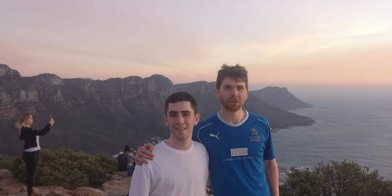
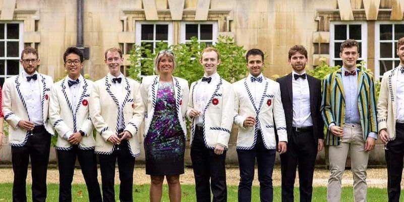
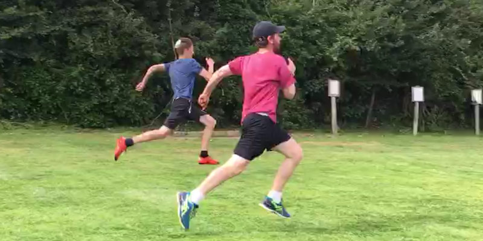
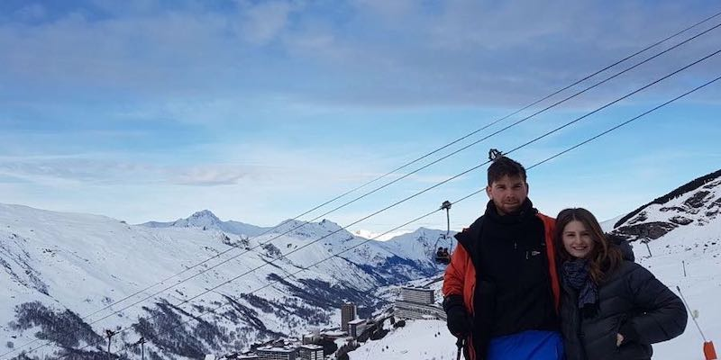

<head>
<link rel="stylesheet" href="style.css">
</head>

# About me
 
Hi, welcome to my blog!
My name's Ezra, I'm 26 and I've been working for a couple of years as a data scientist in the city of London. I studied maths an university and then went on to do a masters in Economics. In my spare time I love hiking, running, rowing, tennis and generally being outdoors. 

<button class="w3-button w3-display-left" onclick="plusDivs(-1)">&#10094;</button>
<button class="w3-button w3-display-right" onclick="plusDivs(+1)">&#10095;</button>

  

For more on my experience and academic background, download my <a href="/img/cv.pdf" download>CV</a>.

# About my blog

I started this blog as a project during the covid pandemic and really enjoyed the process of building and styling a website. 
This is my first (**very**) tentative step into any form of website development. I hope this will only start to look better the more I learn about the web technologies. 
I think there are loads of good reason to write a blog; improving communication, motivating yourself to learn new things and 'giving back' to the community, to name a few.

I use this blog to write up data science ideas that I feel may appeal to a wider audience. I also maintain a [gitbook](https://app.gitbook.com/@ezracitron/spaces) which i use as a [digital garden](https://nesslabs.com/digital-garden-set-up), a place on the internet where I can leave my mark and others can come to explore my thoughts and ideas. 
 

Right now my main interests are in ML, text analysis, data-vis and R, so I'll be focusing on them for now, that will likely change with time, so stay tuned...

