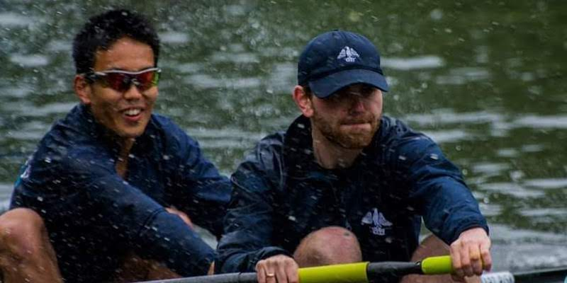
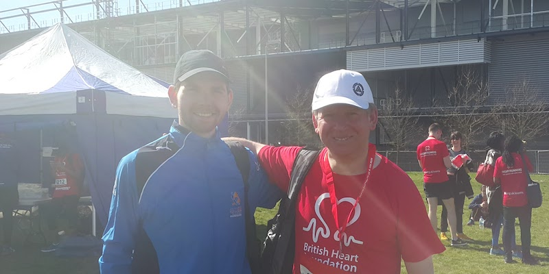

# About me
 
Hi, welcome to my blog!
I studies Maths an University and then went on to do a masters in Economics.
 I'm now 25 and have been working or a couple of years as a data scientist in the city of London. 
 I love Hiking, Running, rowing and generally being outdoors. 

  

For more on my experience and academic background, download my <a href="/img/cv.pdf" download>CV</a>.

# About my blog

I started this blog as a project during the Covid pandemic, and really enjoyed the process of building and styling a website. 
This is my first (**very**) tentative step into any form of website development, 
so I hope this will only start to look better the more I learn about the underlying technologies. 
I think there are loads of good reason to write a blog, improving communication, motivating yourself to learn new things and 'giving back' to the community, to name a few.

I think of this this website as somewhere between a blog and a personal notepad. I also maintain a [gitbook](https://app.gitbook.com/@ezracitron/spaces) which i use as a [digital garden](https://nesslabs.com/digital-garden-set-up), a place on the internet where I can leave my mark and others can come to explore my thoughts and ideas. 

I'll be using this blog to write up about data science ideas that I feel are worth sharing.
Right now my main interests are in ML, text analysis, data-vis and R, so I'll be focusing on
these 4 things for now, that will likely change with time, so stay tuned...

