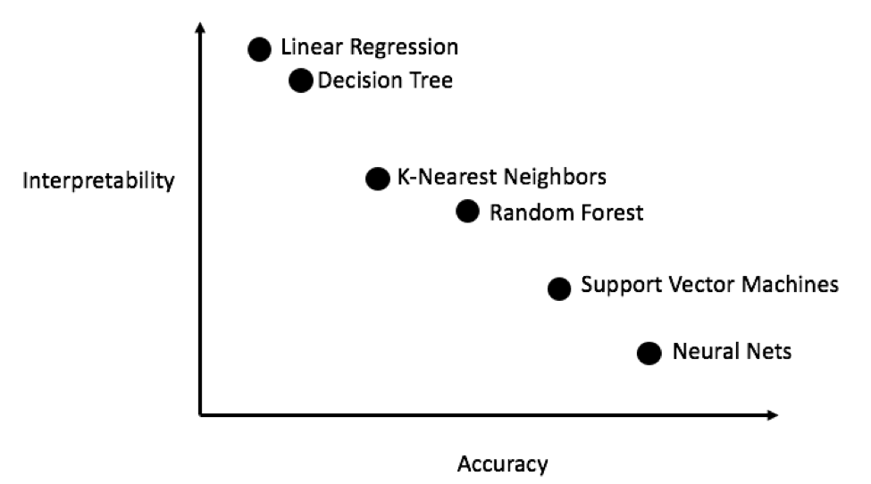

<head>
<link rel="stylesheet" href="style.css">
</head>
<h2>
  

    A collection of resources I like
    

</h2>

   

### R {#R}
- [R for Data Science](https://r4ds.had.co.nz/), for me, is the definitive guide to data science in R and can help you think about data problems. It is both highly approachable and will get you quite far along in your data needs and give you a robust beginner framework to think about data science problems. [Advanced R](https://adv-r.hadley.nz/) is as it says on the tin. If you really want to understand R as a programming language, this is the book for you (still making my way through it). 

- *The* resource for building package in R is [R Packages](https://r-pkgs.org/) by Hadley Wickham.

- I used hugo and blogdown to create this site. [The blogdown book](https://bookdown.org/yihui/blogdown/) is the best place to start and [this blog](https://alison.rbind.io/blog/2020-12-new-year-new-blogdown/) is a nice intro

- [Tidytext](https://www.tidytextmining.com/) for interpretable ways of gaining insight from text data.

- [Supervised Machine Learning for Text Analysis in R](https://smltar.com/) seems like a follow on from the tidytext package, but for predictive modeling. 

### Bloggers {#Bloggers}
- [Mike Dane's](https://www.youtube.com/channel/UCvmINlrza7JHB1zkIOuXEbw) you tube channel is **very** good. I used him to learn about hugo, which was used to build this site, but there is a lot more on there.

- [Alison Hill](https://alison.rbind.io/projects/) is a recent find and an absoloute teasure strove of information.

- [Cedric Scherer](https://www.cedricscherer.com/), what a man, what a blog.

- Julia Silge has an incredible Youtube channel, taking you through all things tidymodeling. Super useful resource, if, like me, you'd like a framework to rival scikit-learn that will keep you safely within the confines of Rstudio. She also has a [blog](https://juliasilge.com/)

- [Ryans tutorials](https://ryanstutorials.net/) are a cool resource for introductory lesson to some programming fundamentals.

- [Story Bench](https://www.storybench.org/category/how-to/) has tons of interesting blogs.

- [StatQuest](https://www.youtube.com/channel/UCtYLUTtgS3k1Fg4y5tAhLbw) with Josh Stalmer provides simple explanations and refreshers of all things Stats/ML and comes with a healthy dose of ironic uekele playing, whats not to like?! DOIBLE BAMM.

- [fireship](https://www.youtube.com/channel/UCsBjURrPoezykLs9EqgamOA) for all my interest in webdev. Offers great youtube 100 second snippets.

- [Tech with Tim](https://www.youtube.com/channel/UC4JX40jDee_tINbkjycV4Sg) has become a favorite, I enjoy his explanations and he has some good intermediate and Expert python tutorial playlists.  

- [sentdex](https://www.youtube.com/user/sentdex) is an all round fun and inspiring channel that discusses everything from neural networks, financial python and raspberry pie. Would recommend going there for project inspiration. 

### DataVis {#DataVis}

- [The R Graph gallery](https://www.r-graph-gallery.com/) (along with the python and D3) is absolutely indispensable resource. Not only does it have practically every visualization that you could possibly hope to make, but it gives you simple reproducible code to go along with it. It also links to their award winning [data-to-vis](https://www.data-to-viz.com/#explore) websites, which offers a [decision tree](https://www.data-to-viz.com/) (under the 'explore' tab) to pick appropriate visual.

- [GGplot2 book](https://ggplot2-book.org/) by hadley is the definitive guide for ggplot2, which is the go-to vis package in R. Plotnine is a duplicate python package.

- Cedric's ggplot2 [tutrial](https://www.cedricscherer.com/2019/08/05/a-ggplot2-tutorial-for-beautiful-plotting-in-r/#panels) is a great place to go if you're looking to be inspired. Or in fact any/all of his [visualisations](https://www.cedricscherer.com/top/dataviz/)

- [Pudding](https://pudding.cool/) is website dedicated to cool visualization stories. Worth checking out for some inspiration.

### Books {#Books}

- [Regex](https://www.regular-expressions.info/tutorial.html) is a data scientist's superpower. Once you know it, you'll wonder how you ever got by without it, and you'll be surprised how often it shows up. The good news is, it is more important to know the art of the possible, than remember exact regex syntax. 

### Amazing Websites that deserve more attention

- Have you ever wished you know more about git? (the answer should always be yes)
[git-school](https://git-school.github.io/visualizing-git/) have created this neat little webpage that helps you visualize what **actually** goes on when you hit that dreaded git pull.

- For learning markdown [this](https://commonmark.org/help/tutorial/) is great interactive tutorial.

- CSS selectors, useful for telling a computer which part of a webpage you want it to select
[flukeout](https://flukeout.github.io/) does an incredible job at game-ifying CSS selection. If you're not careful, you won't even realise you're learning.

- [Library of Babel](https://libraryofbabel.info/) makes you think about randomness

### Pictures speak louder than definitions

k fold cross validation  

  
Accuracy interpretability *trade-off*  

  

